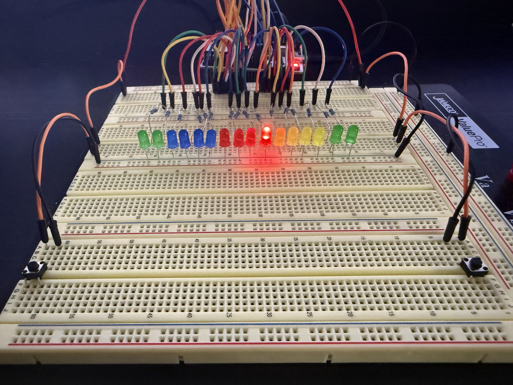

# LED LightChaser

An interactive LED sequencer for the **NUCLEO-L476RG** development board

## Overview
**LED LightChaser** is a project that uses timers, external interrupts, and GPIO to control 16 external LEDs. A **single** lit LED moves in a left or right patternm with the speed increasing each time it rolls off the line. Users can instantly change the direction of the movement by pressing either the left or right button. 

## Demo
<table>
  <tr>
    <td>
      
    </td>

  </tr>
  <tr>
    <td><strong>Features Showcase</strong></td>
  </tr>
</table>

## Features
⚡ **Instant Direction Changing with User Input**  
- Left button: Changes the direction to left
- Right button: Changes the direction to right

💡**LED Lighting Algorithm**
- Only one LED is lit at any given time
- Calculates which LEDs need to be turned on and off

🔄 **Dynamic Speed with Rollover Detection**  
- LED movement speed increases each time the LED rolls off the line
- Speeds cycles through 2 Hz, 4 Hz, 8 Hz, and 16 Hz before resetting back 2 Hz

🕒 **Precise Timing and Control**  
- **TIM2** Controls LED animation speed

👆 **Interrupt-Based Input Handling**  
- External interrupts configured on **PA1**  and **PA4** 
- **TIM2** configured for interrupt generation

🧪 **Bare-Metal Embedded C**  
- No HAL (Hardware Abstraction Layer); relies on direct register access using **CMSIS**

## Hardware Requirements
- **STM32 NUCLEO-L476RG** development board  
- **16 external LEDs**  
  - 4 LEDs for **Color A**  
  - 4 LEDs for **Color B**
  - 4 LEDs for **Color C**
  - 4 LEDs for **Color D**  
- **16 current-limiting resistors** (220Ω–470Ω, one per LED)  
- **2 external pushbuttons**  
  - Connected to **PA4** (left) and **PA1** (right)  
  - Internally pulled-up  
- Breadboard and jumper wires  
- USB cable for power and programming via ST-Link
